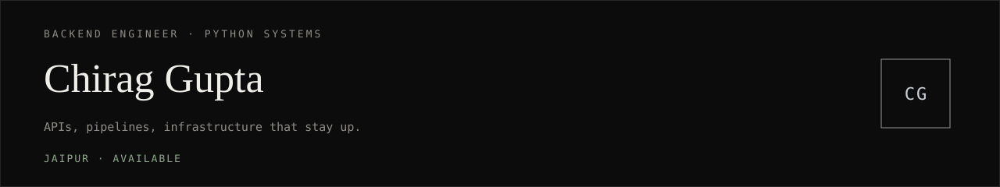

<div>
  
</div>

**Backend engineer** · Python systems · Jaipur, India

I build APIs, pipelines, and infrastructure that stay up — not just ones that ship. Three years across EdTech, insurance, and cloud-native. Open to backend / Python roles (on-site · hybrid · remote). **Available immediately.**

```
uptime      99.9%
latency     < 200ms
students    10K+
tickets     −80%
```

## Systems

**[BigQuery Cross-Environment ETL](https://github.com/chirag876/BigQuery-Cross-Environment-ETL-Pipeline)** — Serverless GCP pipeline. Impersonates client service accounts, extracts BigQuery billing data, transforms it, and loads a centralized warehouse with a MySQL audit trail. Pub/Sub, Cloud Functions, asyncio, retries, incremental loads.

**[ERGenix](https://github.com/chirag876/ERGenix)** — Point it at live MySQL / PostgreSQL / SQLite. Instant ER diagrams, table stats, export. Credentials never persist.

**[MockForge](https://github.com/chirag876/MockDataGenerator)** — Schema-driven mock data. 11 domain presets, preview / download / seed directly into a database. FastAPI + Pydantic v2.

**[WhiteSpace](https://github.com/chirag876/WhiteSpace)** — Collaborative whiteboard. Django Channels, live cursors, host controls, UUID sessions. In progress.

**[Smart PDF Extractor](https://github.com/chirag876/Smart-PDF-Extractor)** — FastAPI. Text, tables, metadata, invoices. OCR for scans, Gemini fallback, auto cleanup.

**[OfflineScribe](https://github.com/chirag876/OfflineScribe)** — Local audio/video transcription with faster-whisper. No API, no internet, nothing leaves the machine.

## Work

**Edufusion Ventures** `Sept 2025 – May 2026`
Digital assessment for 10K+ students · sub-200ms APIs · 1,000+ Zoom sessions/day at 99.9% uptime · exam registration that cut support tickets 80%.

**D3V Technology Solutions** `April 2025 – June 2025`
Cloud-native ETL on GCP · BigQuery migration · Cloud Functions + Pub/Sub + asyncio.

**Spectral Tech AI** `Jan 2023 – March 2025`
NLP pipelines for insurance · BI in Power BI / Tableau / Qlik · Azure data pipelines · CRM on CQRS + REST.

## Stack

`Python` `FastAPI` `Flask` `Django` `MySQL` `PostgreSQL` `MongoDB` `BigQuery` `GCP` `Azure` `Docker` `Pub/Sub` `SQLAlchemy` `Pydantic v2` `Pandas` `Power BI`

## Contact

[Email](mailto:chirag1706gupta@gmail.com) · [LinkedIn](https://linkedin.com/in/chiraggupta1706) · [GitHub](https://github.com/chirag876)
